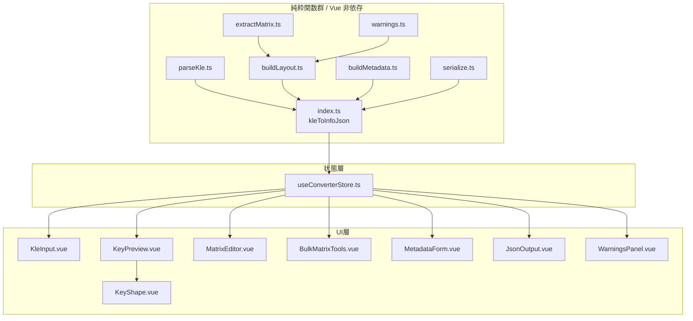

# KBDinfo 設計書

## 1. モジュール構成



## 2. ディレクトリ構成

```
KBDinfo/
├── src/
│   ├── main.ts                 # Pinia 組込・App マウント
│   ├── App.vue                 # 全体レイアウト（2カラム grid）
│   ├── style.css               # Tailwind + カスタム @layer components
│   ├── env.d.ts                # kle-serial 型補完、Vue SFC shim
│   ├── types/
│   │   ├── kle.ts              # kle-serial 型再エクスポート
│   │   ├── qmk.ts              # InfoJson 等の QMK 型
│   │   └── app.ts              # UI状態・警告・デフォルト値
│   ├── converter/              # 純関数群
│   ├── composables/
│   │   └── useSvgGeometry.ts   # viewBox 計算、色輝度判定
│   ├── stores/
│   │   └── useConverterStore.ts
│   └── components/             # Vue SFC
├── tests/
│   ├── extractMatrix.test.ts
│   ├── buildLayout.test.ts
│   └── kleToInfoJson.test.ts
├── docs/                       # 要件定義書・仕様書・設計書（BOM UTF-8）
├── public/favicon.svg
└── .github/workflows/pages.yml
```

## 3. 主要関数シグネチャ

```ts
// converter/index.ts
export const kleToInfoJson = (
  raw: string,
  metadata: MetadataFormState,
  overrides?: MatrixOverrides,
): { info: InfoJson; json: string; warnings: Warning[] }

// converter/parseKle.ts
export const parseKleRaw = (raw: string): KleKeyboard
// JSON構文/KLE構造エラー時は KleParseError を投げる

// converter/extractMatrix.ts
export const parseMatrixLabel = (raw: string | null | undefined): MatrixCoord | null

// converter/buildLayout.ts
export const buildLayout = (
  kb: KleKeyboard,
  overrides?: MatrixOverrides,
): { layout: LayoutKey[]; warnings: Warning[] }

// converter/buildMetadata.ts
export const seedFromKle = (kb: KleKeyboard): Partial<MetadataFormState>
export const buildInfoJson = (
  form: MetadataFormState,
  layout: LayoutKey[],
  layoutName?: string,
): InfoJson

// converter/serialize.ts
export const serializeInfoJson = (info: InfoJson): string
```

## 4. Pinia ストア設計

`useConverterStore` に以下をすべて集約:

| フィールド | 型 | 用途 |
|---|---|---|
| `rawInput` | `Ref<string>` | KLE raw 入力（Sample プリセット付き） |
| `keyboard` | `ShallowRef<KleKeyboard | null>` | パース結果（大規模対応で shallowRef） |
| `parseError` | `Ref<string | null>` | パースエラーメッセージ |
| `matrixOverrides` | `Ref<Record<number, [row,col]>>` | UI で設定した matrix 上書き |
| `metadata` | `Ref<MetadataFormState>` | メタデータフォーム状態 |
| `selectedOriginalIndex` | `Ref<number | null>` | プレビュー選択キーの原配列 index |
| `visibleKeyIndices` | Computed | decal 除外した原配列 index 一覧 |
| `layoutResult` | Computed | `buildLayout` 結果 |
| `infoJson` | Computed | `buildInfoJson` 結果 |
| `jsonText` | Computed | `serializeInfoJson` 結果 |
| `warnings` | Computed | パースエラー + レイアウト警告 + メタ情報警告 |

**アクション:** `parse()`（debounced 250ms、`watch(rawInput, ..., immediate)`）、`setOverride()`、`clearOverrides()`、`bulkNumber()`、`loadSample()`

## 5. 一括自動採番アルゴリズム

### 行優先（`by-row`）

1. 可視キーを `(y, x)` 昇順でソート
2. y 座標が前キーと 0.5 未満離れているなら同一行、そうでなければ新しい行として分割
3. 各行について左→右の順で col = 0, 1, 2, ... を割当
4. 行 index が row になる

### 列優先（`by-col`）

同様に x 座標でクラスタリングし col 番号を先に決定、各列の上→下で row を採番

しきい値 0.5 は標準 1u キーに対して十分な判別性を持つ値（一般的なレイアウトの段差 0.25u を超える）。

## 6. SVG 描画の数学

- 単位: `U = 54px`
- viewBox 算出: 全キーの四隅（回転考慮）から min/max を取得し、8px パディング付与
  - 回転のある四隅は `rotatePoint(x, y, cx, cy, angle)` で変換
- 各 `<g>` の transform: `rotate(angle, cx*U, cy*U)`
- コントラスト文字色: 背景色 RGB から相対輝度 `0.299R + 0.587G + 0.114B` を算出し、0.6 超で黒、以下で白

## 7. 型安全性方針

- `tsconfig.json` strict, noImplicitAny, noUnusedLocals, noUnusedParameters 有効
- `@ijprest/kle-serial` は型定義が不完全なため `src/env.d.ts` で最小限の ambient 宣言を自前で用意
- TypeScript は build 時に `vue-tsc --noEmit` で事前チェック
- Vue SFC は `<script setup lang="ts">` のみ使用

## 8. テスト戦略

| テストファイル | 対象 | 代表ケース |
|---|---|---|
| `extractMatrix.test.ts` | parseMatrixLabel 全分岐 | `"0,0"`, `"K03"`, `"R2C5"`, `"K0312"`, null/空, 非数値 |
| `buildLayout.test.ts` | buildLayout の挙動 | decal除外、w/h=1省略、回転出力、matrix優先順位、重複警告、二次矩形警告 |
| `kleToInfoJson.test.ts` | 統合動作 | 2×2最小、override優先、回転、不正JSON |

全テスト jsdom 環境で `Serial.deserialize` を実際に実行し、副作用なしで完結。

## 9. GitHub Pages デプロイ設計

### Vite 設定

```ts
// vite.config.ts
export default defineConfig({
  base: './',            // 相対パスで生成し任意のサブパスに対応
  plugins: [vue()],
  test: { environment: 'jsdom', globals: true },
})
```

### GitHub Actions ワークフロー

`.github/workflows/pages.yml`:

1. トリガ: `push` → `main`
2. `actions/checkout@v4`
3. `actions/setup-node@v4` Node 24
4. `npm ci`
5. `npm run build`
6. `actions/upload-pages-artifact@v3` で `dist/` をアップロード
7. `actions/deploy-pages@v4` で Pages に公開

リポジトリ設定の Pages ソースを **GitHub Actions** にする。独自ドメイン不要。

## 10. 警告解消方針

- `npm audit` 0件を維持（依存 pin で担保）
- deprecated 警告は依存更新か `overrides` で抑制
- TypeScript の noUnusedLocals / noUnusedParameters を有効化し未使用シンボルを許容しない

## 11. ライセンス・クレジット

- `@ijprest/kle-serial`（MIT） を利用
- QMK info.json スキーマを参考
- 本プロジェクト自体のライセンスは未決定（作業者の決定を待つ）
