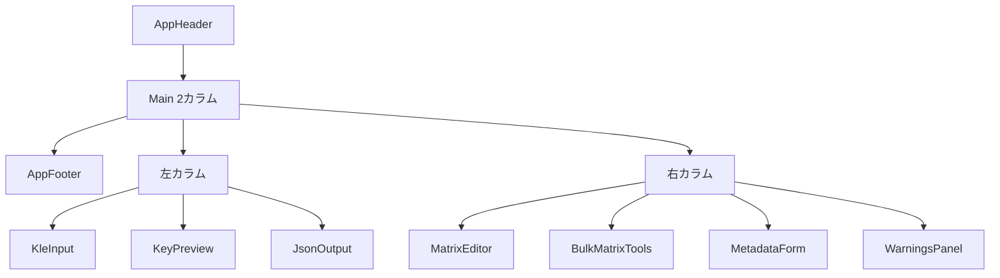

# KBDinfo 仕様書

## 1. 概要

ブラウザ完結型の KLE raw → QMK info.json 変換ツール。Vue 3 + TypeScript + Tailwind CSS + Vite で実装し、GitHub Pages へデプロイする。

## 2. 技術スタック

| レイヤ | 採用技術 |
|---|---|
| ランタイム | Node.js 24.4.1 (nodenv 管理) |
| UI フレームワーク | Vue 3 (Composition API) |
| 状態管理 | Pinia |
| スタイリング | Tailwind CSS 3 |
| ビルド | Vite 8 |
| 型 | TypeScript 5 (strict) + vue-tsc |
| KLE パーサ | `@ijprest/kle-serial` 0.15 |
| テスト | Vitest 4 + @vue/test-utils |
| デプロイ | GitHub Pages（Actions 経由） |

## 3. 画面構成



## 4. データフロー

```mermaid
graph LR
  Raw[raw KLE文字列] --> Parse[parseKleRaw]
  Parse --> KB[KleKeyboard]
  KB --> Filter[decal除外]
  Filter --> BL[buildLayout]
  MO[matrixOverrides] --> BL
  MF[MetadataFormState] --> BM[buildInfoJson]
  KB --> BM
  BL --> BM
  BM --> Info[InfoJson]
  Info --> S[serializeInfoJson]
  S --> Out[info.json文字列]
  BL --> W[Warning[]]
  BM --> W
```

## 5. 変換仕様

### 5.1 入力 → 出力マッピング

KLE key フィールド | QMK LayoutKey フィールド | 備考
---|---|---
`x` / `y` | `x` / `y` | `round6` で丸め
`width` / `height` | `w` / `h` | `1` のときは省略
`rotation_angle` | `r` | 0 のとき省略
`rotation_x` / `rotation_y` | `rx` / `ry` | `r` と同時出力
`labels[0]` の1行目 | `label` | 空文字は省略
`labels[0]` から matrix 抽出 | `matrix` | §5.2 参照
`x2` / `y2` / `width2` / `height2` | **出力しない** | 警告を発生
`decal: true` | **出力しない** | プレビューのみ表示

### 5.2 matrix 座標解決の優先順位

1. ユーザー UI で設定した override（`matrixOverrides[originalIndex]`）
2. `labels[0]` の1行目を `parseMatrixLabel` で解析
   - `/^(\d+)\s*,\s*(\d+)$/` → `"0,0"` 形式
   - `/^[Rr](\d+)[Cc](\d+)$/` → `"R2C5"` 形式
   - `/^[Kk](\d{2})(\d{2})$/` → `"K0312"` 形式（4桁）
   - `/^[Kk](\d)(\d)$/` → `"K03"` 形式（2桁）
3. フォールバック `[0, visibleIndex]` + 警告「fallback-matrix」

### 5.3 JSON 整形仕様

- インデント: スペース 4個
- キー順序:
  - 最上位 `keyboard_name → manufacturer → maintainer → url → usb → features → matrix_pins → diode_direction → processor → bootloader → layouts`
  - LayoutKey `label → matrix → x → y → w → h → r → rx → ry`
- 末尾改行: LF 1個
- 文字コード: UTF-8（非 ASCII はそのまま）

### 5.4 警告種別

`kind` | 説明
---|---
`parse-error` | JSON または KLE 構造の解析失敗
`unparsed-label` | ラベルから matrix 抽出できず
`fallback-matrix` | ラベル未抽出のためフォールバック採番
`dropped-secondary-rect` | 二次矩形を出力からドロップ
`dropped-meta-field` | QMK に対応しない KLE メタ情報
`duplicate-matrix` | 同じ matrix 座標が複数キーに割当

## 6. UI 仕様

### 6.1 入力パネル（KleInput.vue）

- `<textarea>` で RAW JSON を編集（monospace）
- 「ファイル読込」: `.json / .txt` を UTF-8 で読取
- 「サンプル読込」: 2×2 のサンプルレイアウトをセット
- パースエラー時は赤バナー表示

### 6.2 プレビュー（KeyPreview.vue + KeyShape.vue）

- SVG で配置描画（1u = 54px、パディング 8px）
- 各キーを `<g>` でラップし、`rotation_angle` があれば `transform="rotate(...)"`
- 二次矩形があれば副 `<rect>` 描画（警告対象でも視認用に表示）
- decal: 破線・半透明、matrix 非表示
- ghost: opacity 0.35
- 選択中: stroke=blue, width=3
- 背景色の輝度から文字色を自動切替

### 6.3 matrix 編集（MatrixEditor.vue / BulkMatrixTools.vue）

- 選択キーの row/col を数値入力
- 「前/次」で隣接キーへ遷移
- 「行優先/列優先」で自動採番（y/x 座標でクラスタリング、差 0.5 未満を同一行列とみなす）
- 「全オーバーライド解除」で上書きクリア

### 6.4 メタデータフォーム（MetadataForm.vue）

- keyboard_name, manufacturer, maintainer, url
- usb.vid, usb.pid, usb.device_version
- matrix_pins.rows / cols（カンマ・空白区切り文字列 → 配列）
- diode_direction（select）
- processor / bootloader（主要選択肢を select で提供）
- features チェックボックス（bootmagic, mousekey, extrakey, nkro, console, command, backlight, rgblight, audio）

### 6.5 出力（JsonOutput.vue）

- `<pre>` で整形 JSON 表示（暗色テーマ、max-height ≒ 24rem）
- コピー: `navigator.clipboard.writeText`
- ダウンロード: Blob + `a[download]` で `<keyboard_name>.info.json` として保存

### 6.6 警告（WarningsPanel.vue）

- 種別ラベル + キーインデックス + メッセージをリスト表示
- `parse-error` は赤左ボーダー、その他は黄色左ボーダー

## 7. 動作要件

- モダンブラウザ（Chrome / Firefox / Safari / Edge の最新版）
- JavaScript 有効
- Clipboard API はコピー機能に必要（未対応時は noop）

## 8. ビルド・デプロイ

- `npm run dev`: Vite 開発サーバ
- `npm run build`: `vue-tsc --noEmit && vite build` → `dist/`
- `npm run preview`: 本番ビルドのローカルプレビュー
- `npm test`: Vitest 全件実行
- GitHub Actions（`.github/workflows/pages.yml`）が `main` への push で自動ビルド・デプロイ
